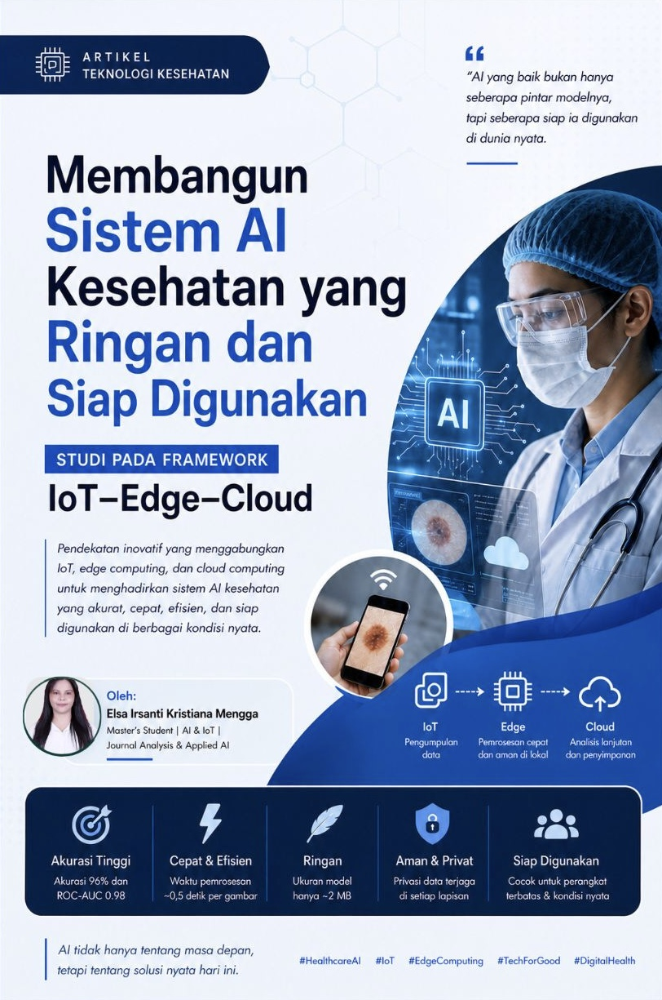

<h1 align="center">🚀 Membangun Sistem AI Kesehatan yang Ringan dan Siap Digunakan</h1>

<h3 align="center">Studi pada Framework IoT–Edge–Cloud</h3>

<i>Oleh: Elsa Irsanti Kristiana Mengga</i>

---

## 📌 Ringkasan Analisis

Di tengah pesatnya perkembangan Artificial Intelligence (AI) di bidang kesehatan, masih banyak sistem yang terlihat “sempurna” di atas kertas tetapi sulit digunakan dalam kondisi nyata. Keterbatasan perangkat, jaringan, dan sumber daya sering kali membuat teknologi canggih menjadi tidak mudah diakses oleh semua orang.

Repositori ini membahas hasil review penelitian mengenai framework **HiPER-Mpox** berbasis **IoT–Edge–Cloud** yang dirancang untuk membangun sistem AI kesehatan yang lebih ringan, efisien, dan realistis digunakan. Melalui pendekatan ini, proses pengolahan data dibagi antara perangkat IoT, edge computing, dan cloud computing untuk meningkatkan kecepatan respon serta mengurangi ketergantungan terhadap infrastruktur besar.

Bagi saya, penelitian ini menunjukkan bahwa teknologi yang baik bukan hanya tentang seberapa tinggi akurasinya, tetapi tentang bagaimana teknologi tersebut benar-benar bisa membantu dan digunakan oleh banyak orang di dunia nyata.

---

## 💡 Key Insights

- Akurasi tinggi tidak selalu berarti siap digunakan
- Edge computing membantu mengurangi latency
- AI kesehatan perlu efisiensi dan aksesibilitas
- IoT–Edge–Cloud membuat sistem lebih fleksibel

---

## 🖼️ Pratinjau Visual

---

## 📂 Lampiran Dokumen

📄 [Download Artikel Jurnal](Artikel_Jurnal_Elsa%20Irsanti%20K.%20Mengga.pdf)

📄 [Download Jurnal Review](Jurnal%20Riview%20-%20Elsa%20Irsanti%20K.%20Mengga.pdf)

---

## 📚 Referensi Jurnal

**A lightweight IoT–edge–cloud framework for Healthcare Internet of Things**  
Cephas Iko-Ojo Gabriel, Randhir Kumar, & Prabhat Kumar. (2026).  
*Ad Hoc Networks*, 187, 104226.

Link Jurnal:  
<https://doi.org/10.1016/j.adhoc.2026.104226>
